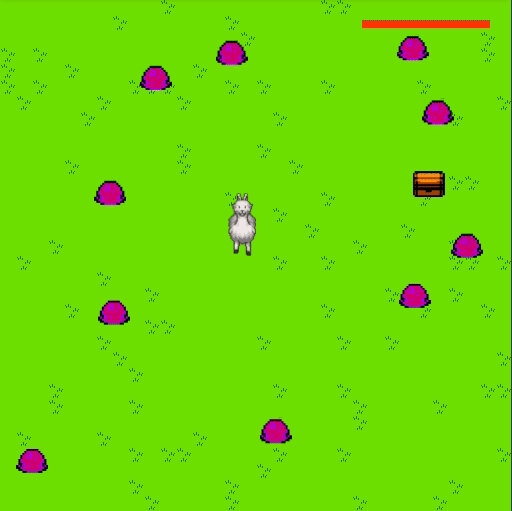

# Workshop Games w/ PixiJS

Introductory workshop on how to make games with PixiJS

- `game` contains the game code

- `de` contains workshop material in German

- `en` does not exist yet, but will contain workshop material in English

Based on 'Learning Pixi' tutorial by [kittykatattack](https://github.com/kittykatattack/learningPixi).
Updated for Pixi 5.3.3, with edits on the final game.
